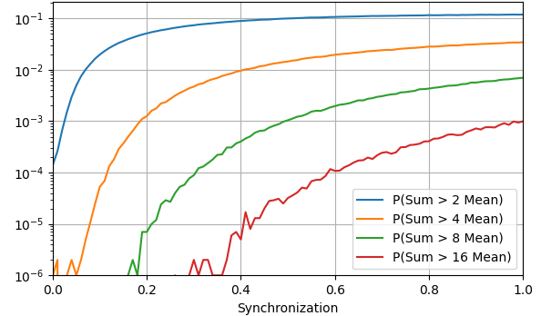

This folder contains the demand synchronization model and additional functionalities and analysis.

The code is mostly adjusted for the usage with the python console.

The most important files are:

- syncmodel.py: contains the core of the synchronization model as a class
- distribution.py: contains functions to generate univariate distributions
- bayes_filter.py: a general bayes filter class
- bayes_filter_syncmodel.py: a bayes filter class specifically for the synchronization model
- bf_monitor_run.py: code for running the bayes filter on generated data
- bayes_inference.py: code for plotting posterior distributions
- ecdf.py: a class for empirical cumulative distribution functions

In the first run of a new syncmodel instance, the Monte Carlo Simulation is calculating the aggregated load
distributions which can take some time.
Therefore, instances are cached with their parameters and automatically loaded when used again.

Example usage:

```python
from syncmodel import SyncModel

# create a model with 100 consumers in resolution 0.1 for s and 1 million MCS samples
s = SyncModel(100, 0.1, sample_size=1e6)

# plot the probability densities of the total demand
s.plot_total_densities(ymax=160)
```


```python
# create the same model with higher resolution for the synchronization
s = SyncModel(100, 0.01, sample_size=1e6)

# plot the outage probabilities
s.plot_prob_exceed(ylimits=[2, 4, 8, 16], normalized=True, log=True)
```


